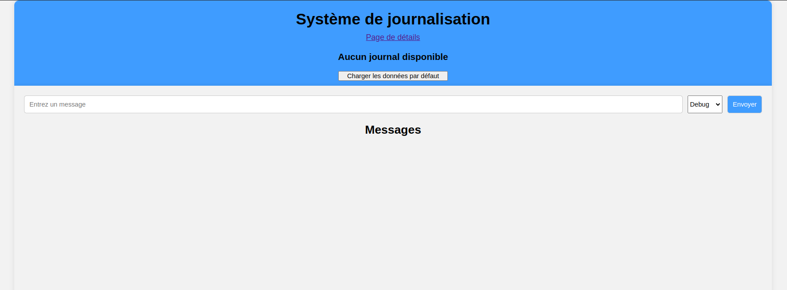
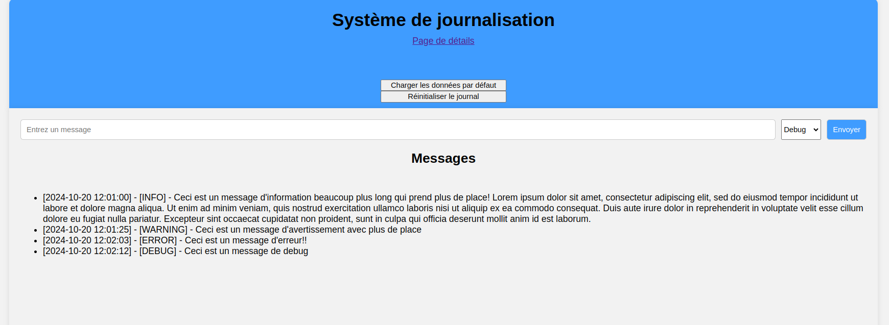
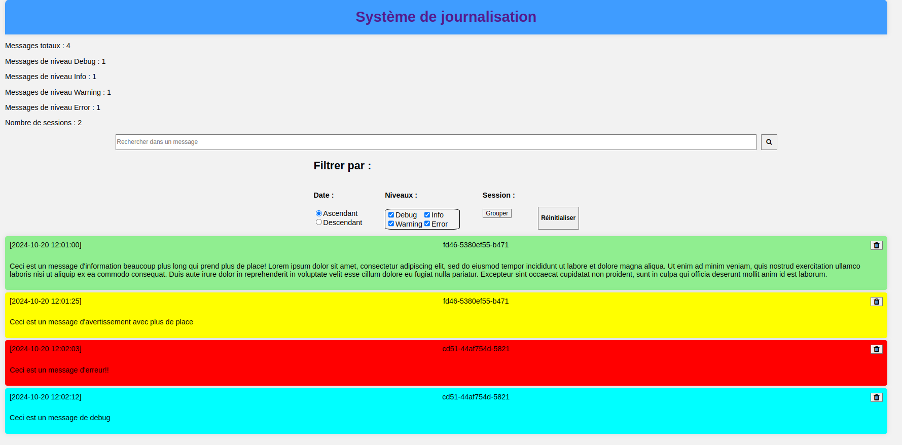
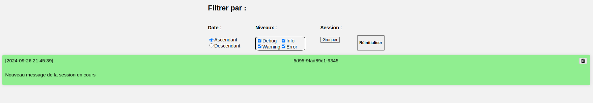
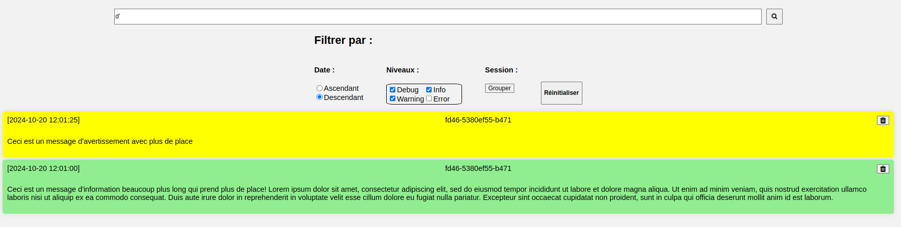

[](https://classroom.github.com/a/bmp-TYFC)
# TP2 PolyJournal

Le but de ce travail est de vous introduire au langage de programmation JavaScript, la manipulation du DOM ainsi qu'approfondir vos connaissances en validation et vérification logicielle. Vous allez vous familiariser avec la syntaxe ES2015 de JavaScript et la gestion des événements dans une page web. Finalement, vous utiliserez un outil d'analyse statique pour le respect de conventions de programmation (_linter_) : ESLint. Cet outil définit un ensemble de règles à suivre pour un code uniforme et standard.

## Installation des librairies nécessaires

Pour installer les dépendances nécessaires, lancez la commande `npm ci` dans le répertoire `site`. Ceci installera toutes les librairies définies dans le fichier `package.json` avec les versions exactes définies dans `package-lock.json`.

## Exécution des tests

Consultez le fichier [TESTS.MD](./TESTS.MD) pour plus d'informations sur les tests du travail. Vous aurez à implémenter du code à partir de certains tests fournis dans ce travail pratique.

## Analyse statique du code

Vous utiliserez l'outil d'analyse statique (_linter_) `ESLint`. Cet outil permet de vérifier que votre code respecte un certain nombre de règles définies dans le fichier de [configuration](./site/eslint.config.js). Par exemple : vous ne pouvez pas utiliser le mot clé `var`, vos lignes ne peuvent pas dépasser 120 caractères, etc. Vous pouvez lancer cet outil à l'aide de la commande `npm run lint` dans votre terminal.

*Note* : il y a des _plugins_ VSCode pour ESLint qui vous indiquent les problèmes directement dans votre éditeur, mais il n'est pas garanti qu'ils sont capables de détecter tous les défauts. Vous devez vous assurer que les défauts sont corrigés en exécutant l'outil en ligne de commande.

## Déploiement local

Vous pouvez faire un déploiement local de votre site avec l'outil `http-server`. Si vous lancez la commande `npm start` dans le répertoire `site`, un serveur HTTP statique sera déployé sur votre machine et votre site sera accessible sur l'adresse `localhost:3000` ou `<votre-adresse-IP>:3000`. La sortie dans le terminal vous donnera l'adresse exacte d'accès.

## Description du travail à compléter

Le but de ce travail pratique est la mise en place d'un système de journalisation avec une persistance locale. Ce système doit permettre d'ajouter des messages dans un journal avec un niveau de gravité (`debug`, `info`, `warning` et `error`) et une session associée. Les messages doivent être affichés dans une page principale et il doit être possible de voir plus de détails dans une page dédiée qui permet d'appliquer des filtres supplémentaires (date, niveau, session et recherche par sous-chaînes) sur les différents messages.

### Structure des données

Un message est défini par les attributs suivants :
```js
{
    id: "def456",
    date: "2024-10-20T12:01:25.000Z",
    text: "Ceci est un message d'avertissement avec plus de place",
    level: "warn",
    session: "fd46-5380ef55-b471"
},
```
L'identifiant est unique pour chaque message et doit être généré lors de l'ajout du message dans le système. Consultez le fichier [utils.js](./site/src/assets/js/utils.js) pour une fonction utilitaire de génération d'identifiants uniques. La date est sous le format [ISO 8601](https://www.iso.org/iso-8601-date-and-time-format.html). La session est un identifiant unique pour chaque session.

Vous trouverez quelques messages de départ dans le fichier [defaultData.js](./site/src/assets/js/defaultData.js) pour vous aider à débuter votre travail.

## Gestion de la persistance

Votre site doit gérer la persistance des entrées du journal en utilisant l'API `Storage` de votre navigateur. À cette fin, vous devez compléter la classe [StorageManager](./site/src/assets/js/storageManager.js) qui permet d'ajouter, récupérer ou supprimer les informations de votre site. Cette classe sera utilisée par plusieurs d'autres classes dans le site.

_Note_ : la clé `log2440-logs` utilisée pour le `Local Storage` et la clé `log2440-tp2-sessionId` utilisée pour le `Session Storage` sont également utilisées dans les tests de Cypress. Veuillez ne pas les modifier.

#### Persistance locale

Tous les messages ajoutés à travers la page principale doivent persister d'une utilisation à l'autre du site. Vous devez utiliser l'API `Storage` pour cette persistance.

La persistance locale doit également être affectée par les deux boutons de la page principale : chargement des données par défaut et la réinitialisation du journal.

Les informations chargées dans la page de détails doivent provenir de la persistance locale.

#### Persistance de session

Vous devez générer un identifiant unique qui sera utilisé pour chaque message ajouté durant cette session. Si l'utilisateur quite le site et ouvre une nouvelle session, un nouveau identifiant doit être généré pour les messages ajoutés. Si l'utilisateur navigue d'une page à l'autre, l'identifiant de session doit être conservé.

## Page principale

Le code HTML de la page principale est déjà fourni dans le fichier [index.html](./site/src/index.html). Veuillez ne pas modifier les `class` et `id` fournis puisqu'ils sont utilisés dans les tests d'acceptation. Vous pouvez modifier les règles CSS si vous voulez améliorer l'apparence de la page.

Par défaut, le visuel de la page est le suivant :
<div style="display:flex; justify-content:center; width:100%; margin:20px">
    
</div>

Un message d'avertissement est présent si le journal est vide et le bouton de réinitialisation est caché. Vous devez afficher le bouton de réinitialisation et cacher l'avertissement seulement si des messages sont présents dans le journal.

Un hyperlien en haut de la page permet de naviguer vers la page de détails. Cette redirection est déjà implémentée pour vous.

Le bouton `Charger les données par défaut` doit charger les messages de `defaultData.js` dans le journal. L'affichage des boutons doit être mis à jour en conséquence et la liste des messages doit être affichée dans une liste avec le format suivant : `[AAAA-MM-JJ HH:MM:SS] - [Niveau] - Texte du message`. Une fonction utilitaire est fournie dans `utils.js` pour formater la date.

Le visuel après le chargement des données par défaut est donc le suivant :
<div style="display:flex; justify-content:center; width:100%; margin:20px">
    
</div>

Le formulaire (`id="log-form"`) permet d'ajouter un message dans le journal avec un niveau de gravité choisi dans une liste déroulante. Une fois le bouton `Envoyer` appuyé, le message est ajouté dans le journal et la liste des messages est mise à jour. Le formulaire doit être vidé après l'ajout du message, mais le niveau de gravité doit rester celui choisi pour le message ajouté.

Si la page principale est rechargée ou accédée à nouveau avec des messages persistés, ces messages doivent être affichés avec le même format que décrit plus haut.

Vous devez compléter le code JavaScript dans le fichier [main.js](./site/src/assets/js/main.js) et [logger.js](./site/src/assets/js/logger.js) pour ajouter les fonctionnalités nécessaires.

Notez que seulement les signatures des méthodes `add` et `loadFromStorage` sont fournis dans la classe `Logger`. Vous devez compléter le code de ces méthodes et ajouter toute autre méthode et attributs nécessaires pour le bon fonctionnement du système sur les deux pages.

## Page de détails

Le code HTML de la page de détails est déjà fourni dans le fichier [details.html](./site/src/details.html). Veuillez ne pas modifier les `class` et `id` fournis puisqu'ils sont utilisés dans les tests d'acceptation. Un affichage statique est fourni pour vous aider à comprendre la structure de la page et des `TODO` sont présents aux endroits où le contenu doit être généré dynamiquement. Vous pouvez modifier les règles CSS si vous voulez améliorer l'apparence de la page.

En assumant que les données par défaut sont chargées dans le journal, le visuel de la page est le suivant :
<div style="display:flex; justify-content:center; width:100%; margin:20px">
    
</div>

La page est divisée en 3 sections : statistiques, filtres et la liste des messages.

#### Statistiques

Les statistiques présentent le nombre total de messages, le nombre de messages par niveau de gravité et le nombre de sessions différentes. Ces informations doivent être calculées au chargement de la page par la fonction `getCombinedStats()` de la classe [DetailsManager](./site/src/assets/js/details.js). 

**Note :** vous devez calculer ces statistiques en faisant **une seule itération** du tableau de messages. Vous **ne pouvez pas** utiliser des boucles `for`, `while` ou `forEach`.

#### Liste de messages

La liste des messages doit contenir l'ensemble des messages du journal avec un code de couleur par niveau de gravité (référez-vous au fichier [styles.css](./site/src/assets/css/styles.css) pour les classes à utiliser).

Chaque message est accompagné par son heure, l'identifiant de sa session et son texte. Référez-vous au fichier [details.html](./site/src/details.html) pour la structure HTML à générer. Un bouton dans le coin supérieur droit de chaque message permet de le supprimer du journal. La suppression doit mettre à jour la liste des messages ainsi que les statistiques.

### Filtres

#### Barre de recherche

La barre de recherche permet de chercher une sous-chaîne spécifique dans le texte des messages. La recherche doit être insensible à la case : `message` et `Message` sont traités de la même manière. Un clic sur le bouton à droite de la barre doit mettre à jour la liste des messages pour afficher seulement ceux contenants la sous-chaîne recherchée.

#### Filtres de date

Les filtres de date permettent de trier la liste en ordre ascendant ou descendant de date de création des messages. Le choix est mutuellement exclusif et doit mettre à jour la liste des messages en conséquence.

#### Filtres de niveau

Les filtres de niveau permettent d'afficher des messages ayant le ou les niveaux choisis. Contrairement à la date, il est possible de sélectionner plusieurs niveaux (ou aucun) en même temps et la liste des messages doit être mise à jour en conséquence.

#### Filtre de session

Le bouton `Grouper` permet d'afficher que les messages ayant été créé lors de la session en cours. Si le bouton est appuyé une deuxième fois, tous les messages sont affichés. La liste des messages doit être mise à jour en conséquence.

Voici un exemple de l'affichage après avoir ajouté un nouveau message durant la session en cours : 
<div style="display:flex; justify-content:center; width:100%; margin:20px">
    
</div>

#### Réinitialisation

Finalement, le bouton `Reinitialiser` permet de réinitialiser les filtres à leur état par défaut (date en ordre ascendant et tous les niveaux à afficher) et la barre de recherche. La liste des messages doit être mise à jour en conséquence.

#### Application des filtres

Les statistiques ne sont pas affectées par la recherche ou les filtres appliqués.

La barre de recherche et les filtres peuvent s'appliquer en même temps et la liste des messages doit être mise à jour en conséquence. Voici un exemple où on recherche `d'` (3 messages dont 1 de type `error`) en ordre descendant de date et avec les niveaux `debug`, `info` et `warn` seulement :
<div style="display:flex; justify-content:center; width:100%; margin:20px">
    
</div>

#### Code à compléter

Notez que seulement les signatures des méthodes `init`, `loadLogs`, `buildLoggerItem` et `getCombinedStats` sont fournis dans la classe `DetailsManager`. Vous devez compléter le code de ces méthodes et ajouter toute autre méthode et attributs nécessaires pour le bon fonctionnement du système. Vous aurez à compléter des méthodes dans la classe `Logger` également. 

Référez-vous aux tests d'acceptation pour plus d'informations sur le fonctionnement de la page. Vous pouvez implémenter les fonctionnalités de la manière que vous souhaitez en autant que les fonctionnalités demandées sont présentes. Tenez compte des bonnes pratiques de programmation et de la modularité de votre code.

## Tests unitaires et l'approche TDD (Test-Driven Development)

Vous devez implémenter la classe `CapLogger` à l'aide des tests fournis. Consultez le fichier [TESTS.MD](./TESTS.MD) pour plus d'informations sur le fonctionnement de la classe et ses tests.

# Fonctionnalité bonus

Dans la version de base, il est possible de filtrer que par la session en cours ou toutes les sessions. Vous devez ajouter une fonctionnalité qui permet de choisir la session à afficher à travers un menu déroulant (balise `<select>`). Les options du menu déroulant doivent être générées dynamiquement à partir des sessions existantes dans le journal. Lorsqu'une session est sélectionnée, les entrées du journal doivent être filtrées pour afficher seulement celles de celle-ci. Les données de départ contiennent déjà des entrées pour plusieurs sessions.

Tous les autres filtres doivent continuer de fonctionner normalement.

Vous devez également implémenter des tests pour cette fonctionnalité. Vous pouvez utiliser le fichier [filters](./site/cypress/e2e/filters.cy.js) et ajouter une autre suite de tests dans un `describe` dédié. Inspirez-vous des autres tests fournis pour écrire les vôtres.

# Correction et remise

La grille de correction détaillée est disponible dans [CORRECTION.MD](./CORRECTION.MD). Le navigateur `Chrome` sera utilisé pour l'évaluation de votre travail. L'ensemble des tests fournis doivent réussir lors de votre remise. Les tests ajoutés par l'équipe doivent aussi réussir.

Le travail doit être remis au plus tard le vendredi 25 octobre à 23:59 sur l'entrepôt Git de votre équipe. Le nom de votre entrepôt Git doit avoir le nom suivant : `tp2-matricule1-matricule2` avec les matricules des membres de l’équipe. Une pénalité de **10%** sera appliquée en cas de non-respect de cette nomenclature.

**Aucun retard ne sera accepté** pour la remise. En cas de retard, la note sera de 0.